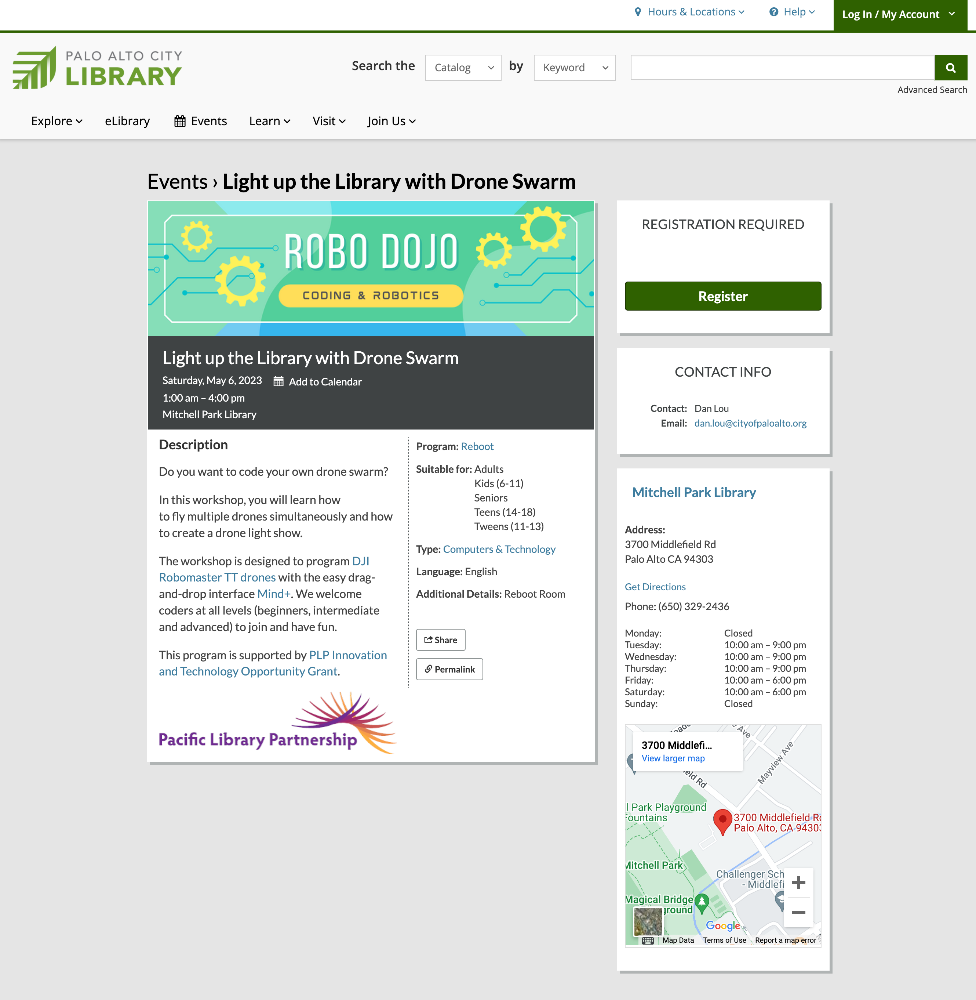

# Robomaster Drones and Mind+
This GitHub repository, developed by Dan Lou, provides instructions and examples for using Mind+ to code a DJI Robomaster TT drone swarm. 
# Light up the Library with Drones

This GitHub repository, developed by Dan Lou, provides instructions and examples for using Mind+ to code a DJI Robomaster TT drone swarm. Mind+ is a visual programming language that makes it easy to program complex robotics projects, including drone swarms.

The project is the result of a [Pacific Library Partnership](https://www.plpinfo.org/) [innovation grant](https://www.plpinfo.org/innovation-grants/2022-plp-innovation-and-technology-opportunity-grant-recipients/) “Light up the Library with Drones”, which aims to promote digital literacy to the community.

## What is DJI Robomaster TT?

DJI Robomaster TT drones are educational drones sponsored by DJI, the world's leading drone manufacturer.

## What is Mind+?

Mind+ is a visual programming language that makes it easy to program robotics projects. With Mind+, you can drag and drop blocks to create complex programs without having to write any code. 

## Get Started

To get started with coding Robomaster drone swarms using Mind+, follow the instructions below.

### Connect Robomaster Drones to Your WiFi

1. Install Mind+ on your computer. You can download Mind+ from the official website [https://mindplus.cc/](https://mindplus.cc/).
2. Open Mind+ and click Extensions, add both Robomaster Drone (Single) and Robomaster Drone (Team).
3. Switch on a Robomaster drone and connect the computer to the drone's default network.
4. Add the Robomaster drone as a device in Mind+ using the Robomaster Drone (Single) extension.
5. Next connect the drone to the WiFi network of your choice by using the following block in Robomaster Drone. Replace [yourSSID] and [yourPASSWD] with the WiFi network name and password:

> Switch to station mode, connect to the hotspot [yourSSID] password [yourPASSWD]
>
1. Turn on the STA mode on the drone.
2. Repeat the above steps for every drone.

### Connect Multiple Robomaster Drones to Your Computer

1. Connect your computer to the same WiFi the Robomaster drones are using.
2. In Mind+, use the Robomaster Drone (Team) extension to scan for drones by their SNs or SSIDs. If the scan find all the drones, you can get to the next step of programming the drones. If not, try to troubleshoot and if necessary, go back to the previous step of connecting drones to your WiFi.
3. You can now use the bocks in Robomaster Drone (Team) extension to create customized choreographed dances with drones. You can also import and try out the example in this repository.

## Examples

This repository provides [example projects](Examples) for coding Robomaster drone swarms using Mind+. The examples include the following movements of drones:

- Basic movement: code the drones to takeoff and land in a synchronized pattern.
- Swarm behavior: program the drones to fly in a coordinated pattern.
- Advanced movement: code the drones to make flips in a synchronized pattern.
- LED light effect: code the drones to change the LED light flashes and breathes, as well as changing the face of LED display.

## A Sample Workshop at the Library

### Workshop title

Light up the Library with Drone Swarm

### Workshop description

Do you want to code your own drone swarm?

In this workshop, you will learn how to fly multiple drones at the same time and how to create a drone light show.

The workshop is designed to program [DJI Robomaster TT drones](https://www.dji.com/robomaster-tt) with the easy drag-and-drop interface [Mind+](https://mindplus.cc/). We welcome coders at all levels (beginners, intermediate and advanced) to join and have fun.

This program is supported by [PLP Innovation and Technology Opportunity Grant](https://www.plpinfo.org/innovation-grants/2022-plp-innovation-and-technology-opportunity-grant-recipients/).

### Materials

- DJI Robomaster TT drones
- Programmer have access to a laptop with Mind+ installed
- Customers bring in laptops with Mind+ installed
- A WiFi network with network name and password that can be used for the drones
- Slides for the workshop

### Staff and Volunteers

- Depending on the size of the workshop

### Promotion

We posted the event in the events module in the Library's webiste.

We also promoted it on the Library's homepage and the robotics page.

